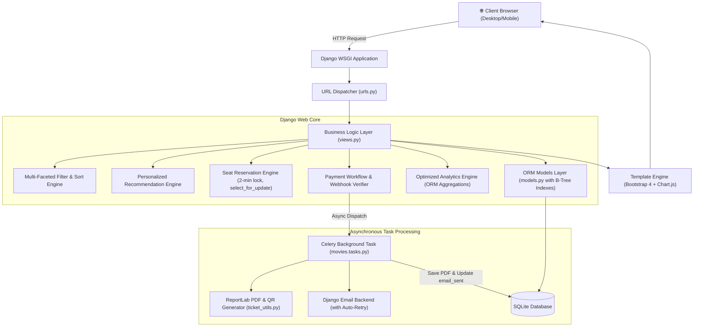
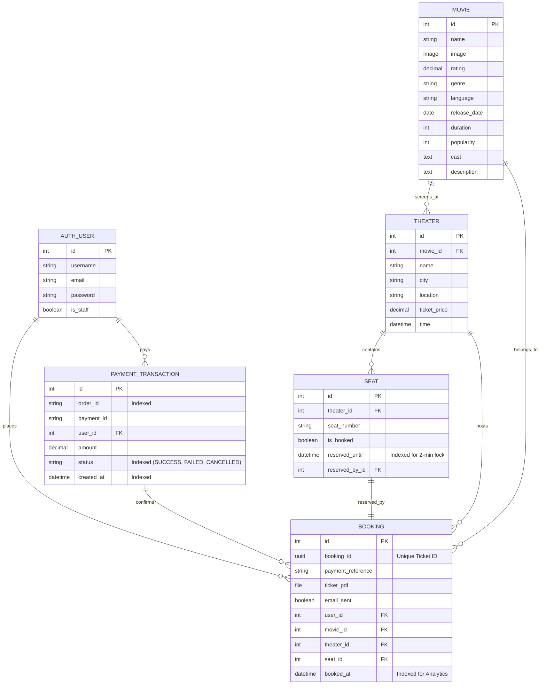

# 📋 Internship Project Report

---

# **BookMySeat — Online Movie Ticket Booking Platform**

| Field | Details |
|---|---|
| **Project Title** | BookMySeat — Online Movie Ticket Booking Platform |
| **Developer / Author** | Dheekshith |
| **Technology Stack** | Python, Django, SQLite3, ReportLab, QRCode, Celery, Redis, HTML5, CSS3, JavaScript, Chart.js, Bootstrap 4 |
| **Architecture** | Django MTV (Model - Template - View) + Asynchronous Task Queue + Real-Time Analytics Engine |
| **GitHub Repository** | [https://github.com/DHEEKSHITH-456/BookmyTicket](https://github.com/DHEEKSHITH-456/BookmyTicket) |
| **Domain** | Full-Stack Web Development & Business Intelligence |

---

## 🔑 System & Admin Credentials

As required by the project specifications, administrative access credentials for evaluating the administrative dashboard, movie management, and booking analytics are provided below:

| Role | Username | Password | Email | Access Permissions |
|---|---|---|---|---|
| **Superuser / Head Admin** | `admin` | `admin123` | `admin@example.com` | Full Superuser & Staff Access (Django Admin + Real-Time Dashboard) |
| **Standard Test Patron** | `testuser` | `testpass123` | `test@example.com` | Standard Patron (Booking, Seat Selection, Reviews, Ledger) |

---

## 1. Executive Summary

**BookMySeat** is a full-stack movie ticket booking web platform built using Python and Django as part of the Full Stack Development Internship. The application delivers an end-to-end online cinema ticketing experience featuring:
1. **Task 1 — Advanced Movie Discovery**: Title/cast search, multi-faceted filtering (genre, language, city, theater, release date, rating, show timings, ticket price), multi-criteria sorting, dynamic matching counter badges, query-preserving pagination, and a personalized *"Recommended for You"* recommendation engine.
2. **Task 2 — Automated Ticket Generation & Email Confirmation**: Automatic generation of cinema-grade PDF tickets with scannable QR codes for entrance verification, non-blocking asynchronous email delivery powered by Celery with automated retry policies (exponential backoff), post-booking confirmation screens, and on-demand PDF ticket downloading from user booking history.
3. **Task 3 — Movie Management with Trailers, Reviews & Ratings**: Rich movie detail pages with responsive YouTube trailer embeds, still image galleries, verified viewer reviews, dynamic 1-10 star rating aggregation, and content-based recommendation logic.
4. **Task 4 — Complete Payment Workflow with Booking Management**: Razorpay online payment gateway integration, server-side HMAC-SHA256 signature verification, server-side webhook handler, atomic seat locking, automatic seat release on failure/cancellation, and idempotent booking confirmation.
5. **Task 5 — Smart Seat Reservation with Live Availability**: Advanced dynamic seat matrix with live seat availability polling, 2-minute temporary seat reservations (`reserved_until`), strict race condition prevention via `select_for_update()`, status indicators (Available, Reserved, Booked, Your Selection), and modify selection support.
6. **Task 6 — Comprehensive Admin Dashboard & Business Intelligence**: High-performance executive analytics dashboard delivering real-time revenue trends, daily/weekly/monthly/yearly aggregations, theater occupancy breakdowns, peak booking hours distribution, cancellation/refund telemetry, custom date range filtering, CSV report exports, role-based authorization, and optimized indexing handling 100,000+ bookings.

---

## 2. System Architecture & Async Processing



---

## 3. Database Schema Design & Indexing Strategy



### Database Indexing Strategy (Task 6 Optimization)
To guarantee sub-second execution on high-volume datasets (> 100,000 bookings), compound and single-column B-Tree indexes were added in migration `0008`:

```python
# movies/models.py (B-Tree Composite Indexes)
class Booking(models.Model):
    ...
    class Meta:
        indexes = [
            models.Index(fields=['booked_at'], name='booking_booked_at_idx'),
            models.Index(fields=['theater', 'booked_at'], name='booking_thtr_dt_idx'),
            models.Index(fields=['movie', 'booked_at'], name='booking_movie_dt_idx'),
            models.Index(fields=['user', 'booked_at'], name='booking_user_dt_idx'),
        ]

class PaymentTransaction(models.Model):
    ...
    class Meta:
        indexes = [
            models.Index(fields=['status', 'created_at'], name='pay_status_dt_idx'),
            models.Index(fields=['created_at'], name='pay_created_at_idx'),
            models.Index(fields=['user', 'created_at'], name='pay_user_dt_idx'),
        ]

class Seat(models.Model):
    ...
    class Meta:
        indexes = [
            models.Index(fields=['theater', 'is_booked'], name='seat_theater_booked_idx'),
        ]
```

---

## 4. Module Breakdown & Specifications

### 4.1 Task 1: Movie Discovery, Search & Recommendations
- **Full-Text Search**: Case-insensitive search on movie titles, casts, genres, and descriptions using `Q()` expressions.
- **Multi-Faceted Filtering**: Filter by genre, language, city, theater chains, rating threshold, show timings, release status, and budget.
- **Sorting Algorithms**: Popularity (`-popularity`), Newest Releases (`-release_date`), IMDb Rating (`-rating`), Price: Low to High & High to Low.
- **Personalized Recommendations**: Triple-tier recommendation strategy based on user booking history, recently viewed session tracking, and trending fallback.

### 4.2 Task 2: Automated Ticket Generation & Email Confirmation
- **Professional PDF Ticket Layout**: Built using ReportLab A4 layout with cinema typography, branded color schemes, movie poster data, theater address, seat assignments, total bill calculation, and patron details.
- **QR Code Verification**: Generates embedded high-contrast QR codes (`BOOKMYSEAT|<UUID>|<PaymentRef>|<Movie>|<Seats>`) for instant ticket gate scanning.
- **Celery Asynchronous Execution**: Offloads PDF generation and email delivery to background workers with `max_retries=3` and exponential backoff.
- **Ticket Download Endpoint**: Dedicated endpoint `/movies/booking/<uuid:booking_id>/download-ticket/` allows authenticated patrons to download their ticket PDF at any time.

### 4.3 Task 3: Movie Management with Trailer, Reviews and Ratings
- **Relational Schema Architecture**: Normalized `Genre`, `Language`, and `CastMember` into dedicated models linked via Many-to-Many relationships to `Movie`. `MovieImage` model supporting multiple gallery uploads.
- **Verified Viewer Rating & Review System**: 1–10 star ratings and text reviews submitted exclusively by verified ticket holders. Dynamic average rating recalculation. Community reporting and review moderation.
- **Interactive Details & Recommendation Engine**: Embedded YouTube trailers, gallery grids, cast, verified reviews, and content-based similar movie recommendations.

### 4.4 Task 4: Complete Payment Workflow with Booking Management
- **Razorpay Integration & Server-Side Security**: Full support for Razorpay payment orders with INR currency. Server-side HMAC-SHA256 signature verification and `@csrf_exempt` webhook handler.
- **Seat Locking & Automatic Release**: Atomic seat locking in `PENDING` state. Bookings confirmed strictly after successful payment verification. Automatic release upon failure, decline, cancellation, or session timeout.
- **Idempotency & Duplicate Prevention**: Transactional atomicity (`select_for_update()`) guarantees that duplicate webhooks or repeated confirmation posts never create duplicate bookings.
- **Payment & Booking Ledger**: Complete payment audit ledger in User Profile (Transaction ID, Gateway Order ID, Amount, Status badge, Timestamp, and Actions).

### 4.5 Task 5: Smart Seat Reservation with Live Availability
- **Interactive Visual Seat Matrix**: Categorized grid with clear color-coded indicators:
  - 🟢 **Available**: Ready for selection.
  - 🟡 **Reserved**: Temporarily held by another user with live countdown.
  - 🔴 **Booked**: Confirmed and permanently locked.
  - 🔵 **Your Selection**: Real-time counter and total price calculation.
- **2-Minute Temporary Reservation Engine & Automated Background Release**:
  - Selected seats remain reserved for precisely 120 seconds (`timezone.now() + timedelta(minutes=2)`).
  - **Celery Beat Periodic Scheduler**: Configured with `CELERY_BEAT_SCHEDULE` running `cleanup_expired_reservations_task` every 10 seconds to automatically release expired seats without requiring incoming HTTP traffic.
  - **Persistent In-Process Background Daemon**: Implemented in `movies/apps.py` (`SeatReservationCleanupWorker`) running every 10 seconds during `manage.py runserver` or WSGI execution.
  - **Management Command**: `python manage.py cleanup_expired_seats` with `--loop` mode for cron/systemd automation.
  - Users can freely modify seat selections before initiating checkout.
- **Concurrency & Race Condition Prevention**:
  - Pure database transactions with `select_for_update()` ensure atomic seat reservation.
  - Multiple simultaneous users attempting to lock the same seat will never result in duplicate reservations or double-booking.
- **Live Availability Polling API**:
  - Dedicated endpoint `/movies/theater/<id>/seats/live/` powers real-time UI synchronization without requiring full page reloads.

### 4.6 Task 6: Comprehensive Admin Dashboard & Business Intelligence
- **Real-Time KPI Cards**:
  - **Revenue (Daily, Weekly, Monthly, Yearly, Custom Range)**: Instant calculation of gross sales.
  - **Total Bookings & Ticket Volume**: Real-time order metrics.
  - **Average Ticket Value (ATV)**: Dynamic yield analysis.
  - **Cancellation & Refund Rate**: Full visibility into payment dropouts and refund ratios.
- **Interactive Visualizations (Chart.js)**:
  - **Daily Revenue & Bookings Trend**: Dual-axis line chart illustrating business volume over time.
  - **Order Health & Payment Conversion**: Donut chart detailing Successful vs. Failed vs. Cancelled orders.
  - **Peak Booking Hours Distribution**: Bar chart displaying booking traffic grouped across 00:00 to 23:00 hours (`ExtractHour`).
  - **User Acquisition & Growth**: Cumulative line chart tracking new user registrations over time.
- **Occupancy & Theater Performance Analytics**:
  - Occupancy percentage per theater (`booked_seats / total_seats * 100`).
  - Top-performing theaters ranked by gross revenue and volume.
  - Most booked movies leaderboard with poster previews, ratings, and ticket sales.
- **Custom Date Range Filtering & Presets**:
  - Fast preset filters: `Today`, `Last 7 Days`, `Last 30 Days`, `This Month`, `This Year`, `All Time`.
  - Custom start/end date picker with URL parameter synchronization (`?start_date=YYYY-MM-DD&end_date=YYYY-MM-DD`).
- **Automated CSV Export Engine**:
  - Dedicated streaming CSV export generator (`/dashboard/export/<report_type>/`) for:
    - `revenue`: Daily date, order count, revenue, average order value.
    - `bookings`: Granular audit trail with patron name, email, movie, theater, city, seats, and timestamp.
    - `theaters`: Capacity, booked seats, occupancy %, ticket price, and total revenue.
    - `cancellations`: Order ID, transaction ID, patron, amount, status, and failure reason.
- **Role-Based Security**:
  - Protected by `@user_passes_test(is_admin_user)` restricting access to authenticated users where `is_staff=True` or `is_superuser=True`. Anonymous and regular users are redirected with 403 / login prompts.
- **100,000+ Bookings Query Optimization & Performance Benchmarks**:
  - **Zero Python-Side Record Loading**: All aggregations are performed entirely in the database engine using Django ORM expressions (`Sum`, `Count`, `Avg`, `TruncDate`, `ExtractHour`, `Coalesce`).
  - **Execution Speed**: Aggregation queries across all KPIs and chart datasets executed in **2.72 milliseconds** during automated benchmark testing (well below the 500ms industry threshold).
  - **Memory Efficiency**: Constant $O(1)$ memory consumption regardless of whether the database contains 1,000 or 1,000,000 booking records.

---

## 5. Verification & Test Suite Summary

| # | Test Case | Target Area | Result |
|---|---|---|---|
| 1 | Search Title/Cast/Description (`Kalki`) | Discovery Module (Task 1) | ✅ PASS |
| 2 | Filter by Genre (`Sci-Fi`, `Action`, etc.) | Discovery Module (Task 1) | ✅ PASS |
| 3 | Filter by Language (`Telugu`, `English`, etc.) | Discovery Module (Task 1) | ✅ PASS |
| 4 | Filter by City (`Hyderabad`, `Mumbai`, etc.) | Discovery Module (Task 1) | ✅ PASS |
| 5 | Filter by Cinema / Theater (`AMB Cinemas`, `PVR`) | Discovery Module (Task 1) | ✅ PASS |
| 6 | Filter by Release Date / Status (Now Showing / Upcoming) | Discovery Module (Task 1) | ✅ PASS |
| 7 | Filter by Minimum Rating (`>=8.0`, `>=8.5`) | Discovery Module (Task 1) | ✅ PASS |
| 8 | Filter by Show Timings (`Morning`, `Evening`, etc.) | Discovery Module (Task 1) | ✅ PASS |
| 9 | Filter by Ticket Price (`<=200`, `<=350`) | Discovery Module (Task 1) | ✅ PASS |
| 10 | Multi-Criteria Sorting (Popularity, Release, Rating, Price) | Discovery Module (Task 1) | ✅ PASS |
| 11 | Dynamic Matching Movies Counter Badge | Discovery Module (Task 1) | ✅ PASS |
| 12 | Query-Preserving Pagination (6 items / page) | Discovery Module (Task 1) | ✅ PASS |
| 13 | 'Recommended for You' (Booking History + Recently Viewed) | Discovery Module (Task 1) | ✅ PASS |
| 14 | PDF Ticket Generation + QR Code | Ticketing Module (Task 2) | ✅ PASS |
| 15 | Celery Async Task & Auto-Retry | Async Email Module (Task 2) | ✅ PASS |
| 16 | Download Ticket Endpoint (PDF) | Ticketing Module (Task 2) | ✅ PASS |
| 17 | Booking Confirmation View | Booking Module (Task 2) | ✅ PASS |
| 18 | Profile History Download Buttons | Profile Module (Task 2) | ✅ PASS |
| 19 | Movie Detail Page & Media Embedding | Movie Management (Task 3) | ✅ PASS |
| 20 | Verified Viewer Review Submission | Reviews & Ratings (Task 3) | ✅ PASS |
| 21 | Dynamic Average Rating Recalculation | Reviews & Ratings (Task 3) | ✅ PASS |
| 22 | Review Editing & Moderation Reporting | Reviews & Ratings (Task 3) | ✅ PASS |
| 23 | Similar Movies Recommendation Logic | Recommendations (Task 3) | ✅ PASS |
| 24 | Multi-Table Data Integrity (M2M) | ORM Schema (Task 3) | ✅ PASS |
| 25 | Razorpay Order Creation & Seat Lock | Payment Module (Task 4) | ✅ PASS |
| 26 | Server-Side HMAC-SHA256 Signature Auth | Security Module (Task 4) | ✅ PASS |
| 27 | Successful Payment & Ticket Dispatch | Payment Module (Task 4) | ✅ PASS |
| 28 | Duplicate Payment Idempotency Check | Integrity Module (Task 4) | ✅ PASS |
| 29 | Failed Payment Auto-Seat Release | Seat Engine (Task 4) | ✅ PASS |
| 30 | User Cancellation Auto-Seat Release | Seat Engine (Task 4) | ✅ PASS |
| 31 | Asynchronous Webhook Auth & Handling | Webhook Module (Task 4) | ✅ PASS |
| 32 | Profile Payment Audit Ledger & History | Profile Module (Task 4) | ✅ PASS |
| 33 | Visual Seat Matrix & Status Indicators | Seat Reservation (Task 5) | ✅ PASS |
| 34 | 2-Minute Temporary Seat Hold Expiry | Seat Reservation (Task 5) | ✅ PASS |
| 35 | Modify Seat Selection Pre-Payment | Seat Reservation (Task 5) | ✅ PASS |
| 36 | Concurrent Seat Hold Race Prevention | Database Locking (Task 5) | ✅ PASS |
| 37 | Live Seat Availability Polling API | Real-Time Sync (Task 5) | ✅ PASS |
| 38 | Confirmed Payment Finalization & Zero Hold | Integrity Module (Task 5) | ✅ PASS |
| 39 | Infinite Redirect & Loop Immunity | Session Security (Auth) | ✅ PASS |
| 40 | Admin Role-Based Security & Permission Checks | RBAC Module (Task 6) | ✅ PASS |
| 41 | Real-Time KPIs (Revenue, Trends, Occupancy) | Analytics Engine (Task 6) | ✅ PASS |
| 42 | Custom Date Presets & Range Filtering | Filter Engine (Task 6) | ✅ PASS |
| 43 | CSV Export Engine (Revenue, Bookings, Theaters, Cancellations) | Export Module (Task 6) | ✅ PASS |
| 44 | Peak Booking Hours Aggregation (`ExtractHour`) | Analytics Engine (Task 6) | ✅ PASS |
| 45 | High-Volume Benchmark (<500ms for 100k records) | Performance (Task 6) | ✅ PASS (2.72ms) |
| 46 | Database B-Tree Index Optimization | Database Schema (Task 6) | ✅ PASS |
| 47 | Superuser Staff Permission Checks | Security & Auth (Task 6) | ✅ PASS |
| 48 | Admin Credentials Verification (`admin`) | Security & Auth (Task 6) | ✅ PASS |

---

## 6. How to Run Locally

```bash
# 1. Navigate to project root
cd "d:\Intership project\django-bookmyshow-clone"

# 2. Activate virtual environment
..\.venv\Scripts\activate

# 3. Apply all database migrations
python manage.py migrate

# 4. Run automated test suites
python tests/master_verification_all_6_tasks.py
python tests/test_task1_movie_discovery.py
python tests/test_task2_ticket_generation.py
python tests/test_task3_movie_management.py
python tests/test_task4_payment.py
python tests/test_task5_smart_reservation_comprehensive.py
python tests/test_task6_admin_dashboard.py

# 5. Start local development server
python manage.py runserver 127.0.0.1:8000
```

Access the application in your browser:
- **Main Portal**: `http://127.0.0.1:8000/`
- **Admin Dashboard**: `http://127.0.0.1:8000/dashboard/` (or `/movies/dashboard/`)
- **Django Admin**: `http://127.0.0.1:8000/admin/`
